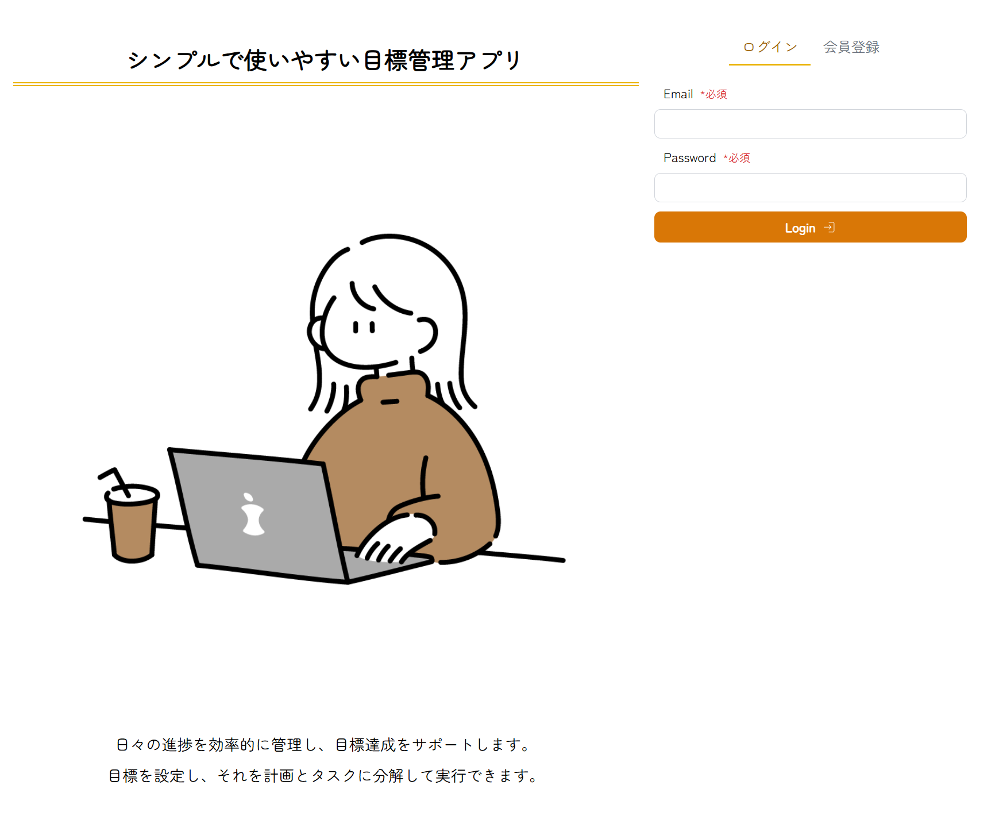
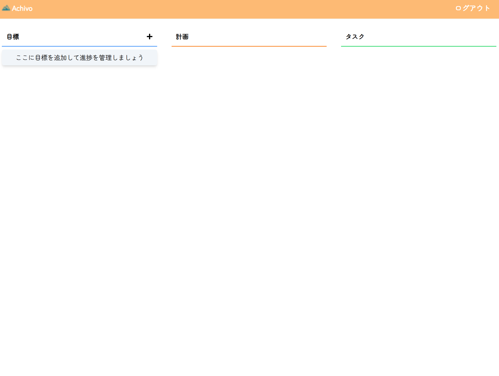
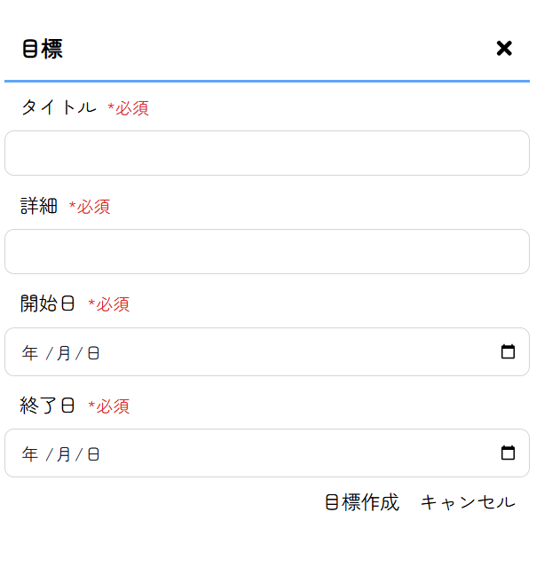
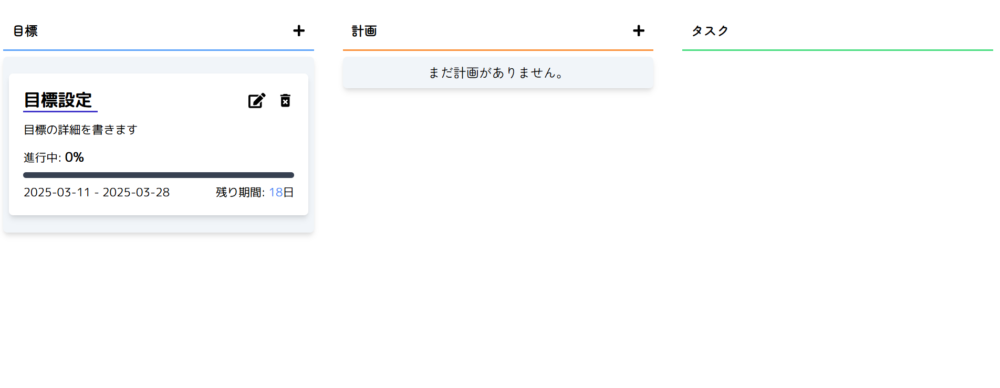
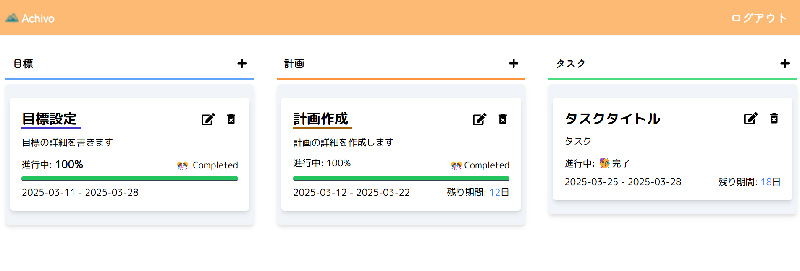
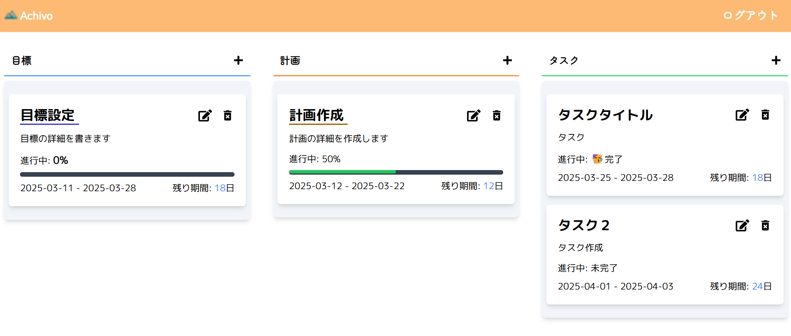

# achivo とは

- 「達成したい目標（goal）、目標を達成するための計画（plan）、さらに計画を分解して小さしたタスク（task）に分解して効率的に目標を達成、管理できるアプリ」です。
- 何か始める時なにから進めばいいのかわからないときに、目標を細かく刻んで目標達成を助けられるアプリになります。
  > URL は以下になります。
  > なぜか iphone ではログアウトができない現象があるので、PC での操作を推奨します。

https://achivo-y4pe.vercel.app/

## 使用技術

## ホーム画面

## メイン画面

## 作成画面

## ゴール画面

## 全体表示

